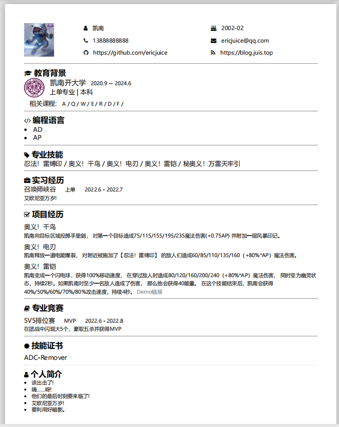

## HTML版的个人简历模板

### 效果预览图

### 自定义方法

- 修改信息：直接修改对应的HTML代码和文字即可
- 添加图标：
    - 修改head中的link，如`<link rel="stylesheet" href="https://cdn.staticfile.org/font-awesome/4.7.0/css/font-awesome.css">`
    - 例如fontawesome的图标，注册地址: https://fontawesome.com/
    - 然后在对应地方加入`<i></i>`标签，设置class即可
- 导出pdf：将HTML文件在浏览器打开，然后打印即可